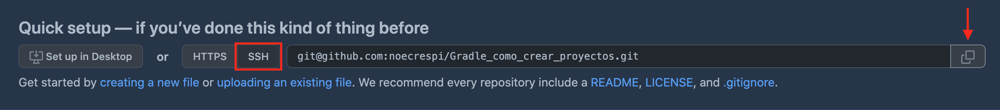
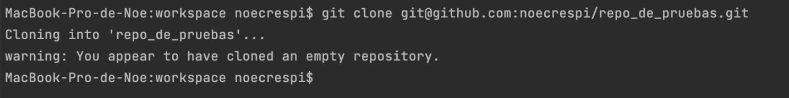
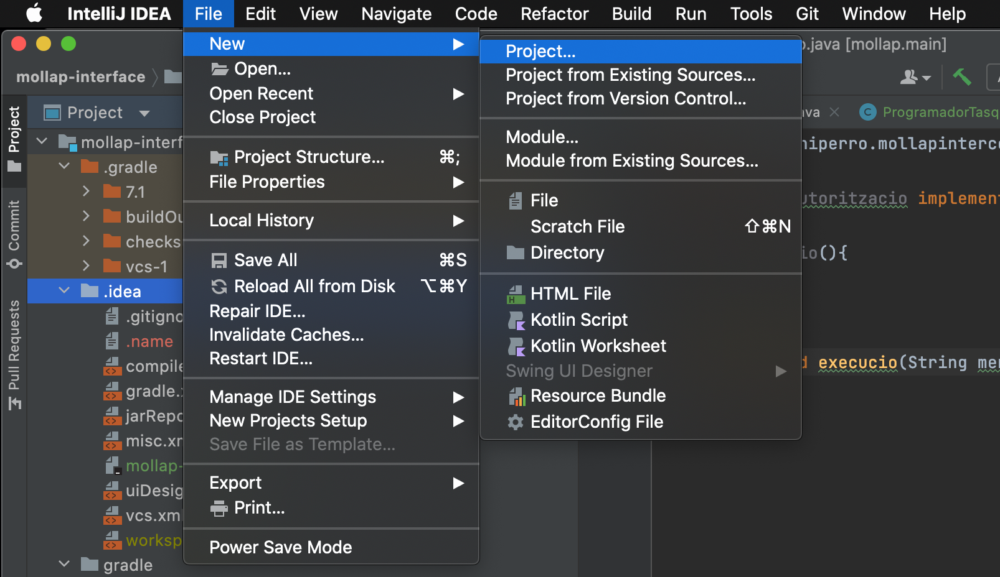
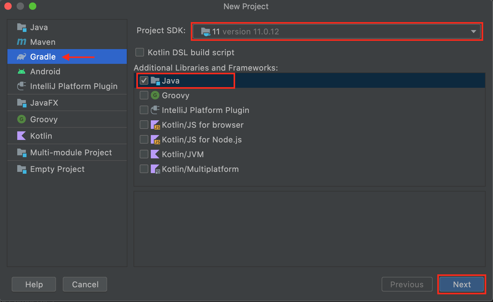
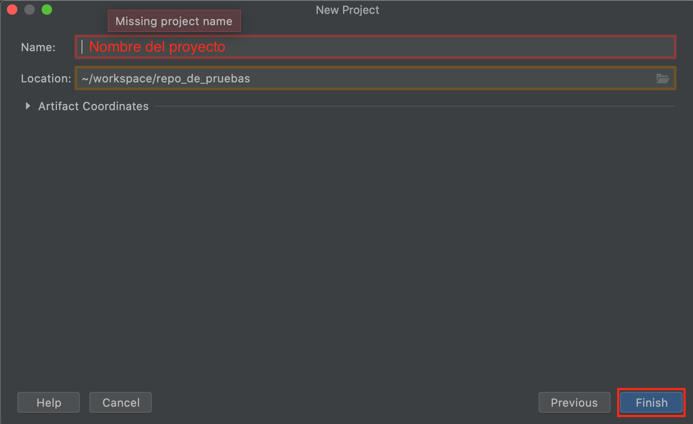
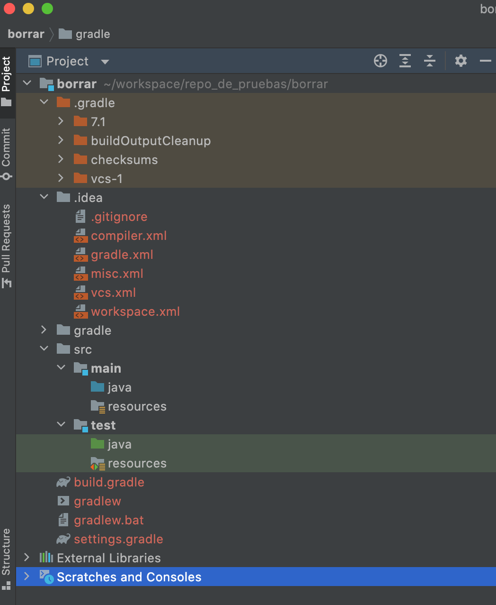
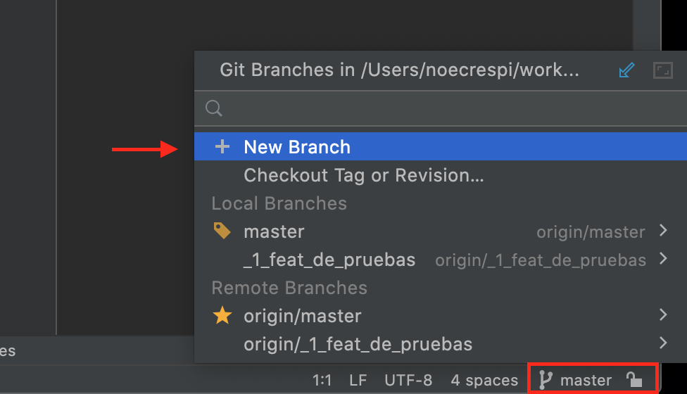
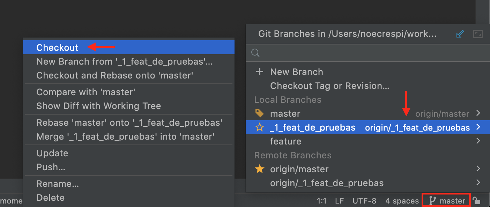
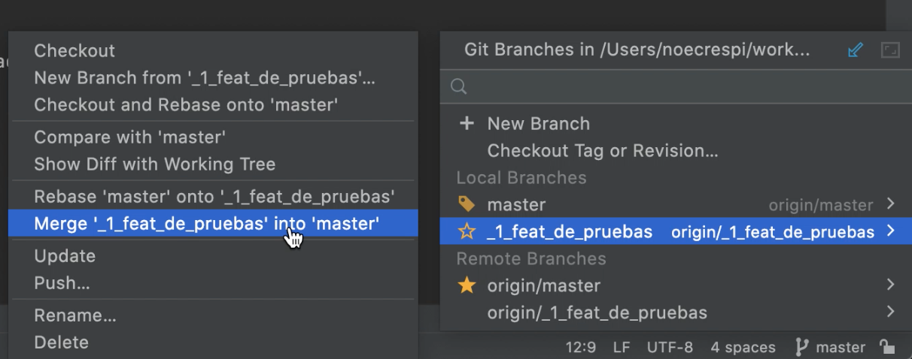
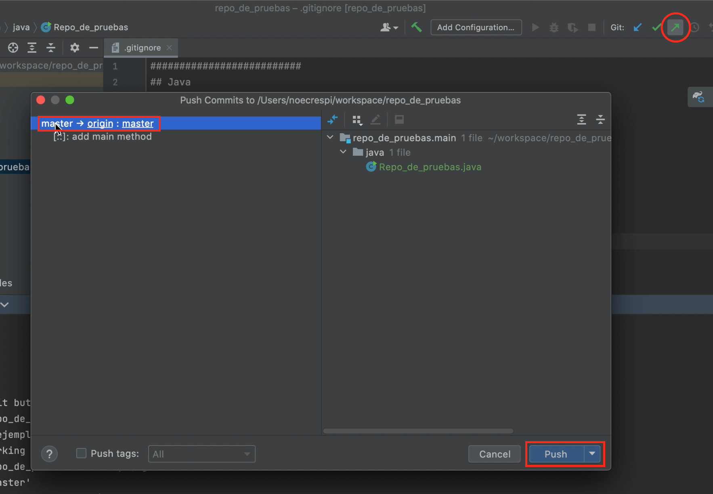

# Gradle

## ¿Qué es Gradle?
---

Gradle es una herramienta de automatización de la construcción de nuestro código
que bebe de las aportaciones que han realizado herramientas como ant y maven 
pero intenta llevarlo todo un paso mas  allá. Para empezar se apoya en Groovy y
en un DSL (Domain Specific Language) para trabajar con un lenguaje sencillo y 
claro a la hora de construir el build comparado con Maven. Por otro lado dispone
de una gran flexibilidad que permite trabajar con ella utilizando otros 
lenguajes y no solo Java. Dispone por otro lado  de un sistema de gestión de 
dependencias sólido.


## ¿Cómo crear un proyecto Gradle y como empezarlo para los trabajo o exámenes?
---

### Crear un repositorio en GitHub y clonarlo en nuestro ordenador
---

1. **Entrar** en el **GitHub**.
2. Hacer **clic** en el **+** de la esquina superior derecha, junto a su avatar
o icono de identificación
3. **Seleccionar New repository** .
4. **Crear** un **repositorio vacio**. Poner un nombre, descripción al 
repositorio y poner el repositorio que sea público.
5. Clicar **Create repository** .
6. **Clonar** el repositorio.
7. **Copiar** el enlace de **SSH**.



8. **Abrir** el **programa** que queremos usar, en mi caso usaré _IntelliJ_. 
9. Abriremos la **terminal** del programa.
10. Buscar, **entrar** en la **carpeta** donde queremos clonar el repositorio y 
la abriremos.
    - `ls` lee los archivos que están en la carpeta
    - `cd nombreCarpeta` entra en la carpeta que has seleccionado
    - `cd` va a una carpeta atrás
    - `mkdir nombreCarpetaNueva`  crea una carpeta del nombre que le has dado
    - `clear` limpiar la pantalla
    - `cd ../` ir para atrás en una carpeta
12. **Pegar**:

```git clone git@github.com:noecrespi/Gradle_como_crear_proyectos.git```



13. **Crear** un **_README.md_** para hablar un poco sobre el proyecto 

### Crear proyecyo en IntelliJ IDEA
---

1. **Abir** el **programa** IntelliJ IDEA.

2. Ir a _**File**_ -> _**New**_ y clicar en **_Project..._** 



3. Se abrirá una nueva pestaña donde:
    - **Clicar** en **_Gradle_**
    - **Selecionar** la versión **_SDK 11_**
    - **Seleccionar** ☑️ **_Java_**
    - **Clicar** en **_Next_**
    


4. **Poner** en **_Name:_** nombre del proyecto (sin espacios) y **clicar** **_Finish_** .
5. **Añadir** una **nueva carpeta** donde contendrá todo el proyecto (_Location_). 



Se creará un proyecto entero con sus carpetas y archivos correspondientes.



6. **Crear y reestructurar** las **carpetas** y dejarlas listo para empezar.

    - En la **carpeta _gradle_**:
        1. **Crear** un archivo (_File_) **_.gitignore_**
        2. **Añadir**:

            ```
            ##########################
            ## Java
            ##########################
            *.class
            .mtj.tmp/
            *.jar
            *.war
            *.ear
            hs_err_pid*

            ##########################
            ## Maven
            ##########################
            target/
            pom.xml.tag
            pom.xml.releaseBackup
            pom.xml.versionsBackup
            pom.xml.next
            release.properties

            ##########################
            ## Gradle
            ##########################
            .gradle
            **/build/
            !src/**/build/

            # Ignore Gradle GUI config
            gradle-app.setting

            # Avoid ignoring Gradle wrapper jar file (.jar files are usually ignored)
            !gradle-wrapper.jar

            # Avoid ignore Gradle wrappper properties
            !gradle-wrapper.properties

            # Cache of project
            .gradletasknamecache

            ##########################
            ## IntelliJ
            ##########################
            *.iml
            .idea/
            *.ipr
            *.iws
            out/
            .idea_modules/

            ##########################
            ## Eclipse
            ##########################
            .metadata
            .classpath
            .project
            .settings/
            bin/
            tmp/
            *.tmp
            *.bak
            *.swp
            *~.nib
            local.properties
            .loadpath

            ##########################
            ## NetBeans
            ##########################
            nbproject/private/
            build/
            nbbuild/
            dist/
            nbdist/
            nbactions.xml
            nb-configuration.xml

            ##########################
            ## OS X
            ##########################
            .DS_Store

            ##########################
            ## VSCode
            ##########################
            .vscode
            ```
        
        3. En **añadir** la misma información al otro archivo de **_.gitinore_** en la **carpeta de _.idea_** . 

    - Dentro de la **carpeta _Java_**:
        1. **clicar** boton derecho ir a **_new_**
        2. **añadir** un nuevo **_package_**
        
            Ej: ```edu.poniperro.nombreDeLaApp```

        

    - Dentro de la carpeta creada crear una carpeta como se indica en el diagrama UML (debajo de cada nombre sale las el orden de las carpetas donde debe estar).

    - **Clicar** en la carpeta **_main_** :
        1. **Clicar** en **_File_** (está en la barra superior).
        2. **Clicar** **_Proyect Structure..._**
        3. **Señeccionar** **_main_** y deci que sea _Sources_
        4. **Seleccionar** que **_test_** sea _Test_ .
        5. **Clicar** en **_Apply_** .
        6. **Clicar** en **_OK_** .
       
    - **Abrir** el archivo **_build.gradle_**, **copiar** el lo siginente y **añadir** en el archivo.
        1. Cambiar nombre `description = 'cotxox'` y poner el nombre de la app.

            ```
                plugins {
                id 'java'
                id 'application'
            }

            repositories {
                mavenLocal()
            }

            group 'org.mollapp'
            version '1.0-SNAPSHOT'
            description = 'cotxox'

            repositories {
                mavenCentral()
            }

            dependencies {
                testImplementation 'junit:junit:4.12'
                testImplementation 'org.hamcrest:hamcrest-all:1.3'
            }

            test {
                useJUnitPlatform()
            }

            java {
                sourceCompatibility = JavaVersion.VERSION_11
                targetCompatibility = JavaVersion.VERSION_11
            }

            application {
                mainClassName = 'poniperro.App'
            }

            jar {
                manifest {
                    attributes 'Main-Class' : 'poniperro.App'
                }
            } 
            ```


### ¿Cómo subir los cabios que voy haciendo a GitHub?
---

1. **Clicar** en la parte izquierda, donde pone **_Commit_** 
2. **Seleccionar** el **archivo** que queremos subir ☑️ . 
3. **Escribir** un **comentario**.
    - Ej: [:nombreEmoji:] descripcion del commit (los git emojis los podemos encontrar [**aquí**](https://gitmoji.dev/) )

**OPCIÓN:**
    
    1. Subirlo directamente a la rama master.
    2. Subirlo a una nueva rama.

**¿Cómo crear una nueva rama?**

1. Ir a la esquina derecha inferior y **clicar** en la la **_rama master_**.
2. **Clicar** en **_New Branch_** . 



3. **Poner** el **nombre** de la rama.
    - Ej: _feature1_

**¿Cómo cambiar de rama?** 

1. **Clicar** esquina derecha inferior y clicar en la **_rama master_** (rama que actualmente se está trabajando).
2. **Seleccionar** la **rama** a la que queremos **cambiar**.
3. **Clicar** en **_Checkout_** .



**¿Cómo subir los cambios de una rama a la principal?**. 

1. **Ir** a la **rama** que queremos que se **añadan los cambios** por ejemplo a la rama principal _master_ .
2. **Clicar** en la esquina derecha inferior y clicar en la **_rama master_** . 
3. **Seleccionar** la **rama que se ha hecho cambios** y la queremos pasar a la rama principal. 
    - Ej: _1_feat_de_pruebas
4. **Clicar** de en  _**Merge'_1_feat_de_pruebas into 'master'**_ . 



5. Hacer un **_push_**, clicar en la flecha verde en diagonal (↗️)en la esquina superior. 
6. Comprobar que los datos estén bien
7. **Clicar** en **_push_**




### ¿Cómo empezar el proyecto una vez hecho los pasos anteriores?

1. **Copiar** y **pegar** la función principal **_Nombre.java_** (**no** se puede modificar su código). Utilízala como guía en el proceso TDD.

2. **Completar** las **clases** que necesites implementando los casos test que necesites.

3. **Organizar** las **clases** en sus paquetes correspondientes.

4 **Observar** el **esquema** propuesto en el import de la clase principal
    - Ej: _Cotxox.java_:

        -import org.foobarspam.cotxox.carrera.Carrera;
        -import org.foobarspam.cotxox.conductores.Conductor;
        -import org.foobarspam.cotxox.conductores.PoolConductores;
        -import org.foobarspam.cotxox.tarifa.Tarifa;
        -import org.foorbarspam.cotxox.main.Cotxox;
